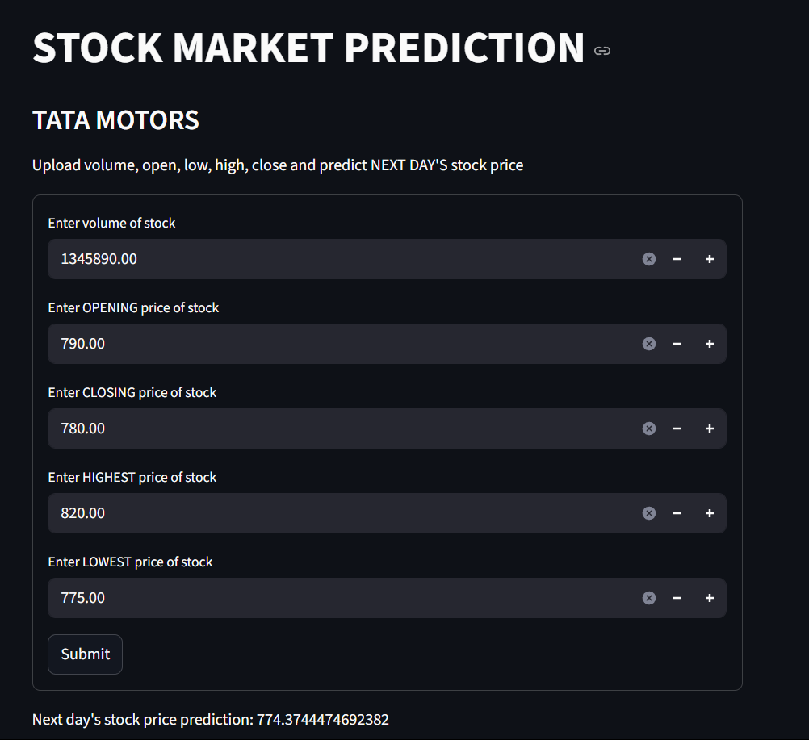

# 📈 Stock Market Prediction - Tata Stock

A machine learning project to predict the next day's **Tata stock price** using historical market features like volume, open, close, high, and low prices.

---

## 🔍 What This Project Does

This project performs stock price prediction for Tata stock using multiple machine learning models:

- Linear Regression  
- Ridge Regression  
- Support Vector Regressor (SVR)  
- Random Forest Regressor  
- K-Nearest Neighbors (KNN) Regressor

The project involves:
- Feature engineering using historical OHLCV data (done in `tata.ipynb`)
- Model training and comparison based on various performance metrics
- Visualization of actual vs predicted prices
- Interactive price prediction based on user input

---

## 💡 Why It's Useful

Stock price prediction can support:

- **Retail traders** making short-term decisions
- **Analysts** testing ML-based forecasting strategies
- **Learners** exploring real-world applications of regression models
- **Data science projects** focused on time-series modeling and finance

With this tool, a user can input the **current day’s volume, open, close, high, and low prices**, and get a prediction for the **next day's price**.

---

## ⚙️ How to Install and Use

### 1. Clone the repository

```bash
git clone https://github.com/your-username/stock-market-prediction.git
cd stock-market-prediction


